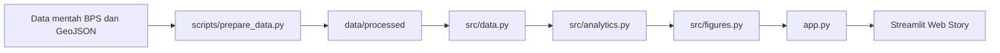

# Jejak Industri Mikro dan Kecil Indonesia

Web data storytelling interaktif untuk proyek UAS **Visualisasi Data dan Informasi**. Aplikasi dibangun dengan **Streamlit** dan **Plotly** untuk membaca kondisi Industri Mikro dan Kecil (IMK) Indonesia melalui tiga sudut pandang: **multivariat, hierarki, dan geospasial**.

Project ini menggunakan data utama dari **Badan Pusat Statistik (BPS)** dan menyajikannya dalam satu alur cerita interaktif yang dapat dibaca dari tingkat provinsi hingga kabupaten/kota.

---

## Tujuan Project

Project ini dirancang untuk menjawab tiga pertanyaan utama:

1. Bagaimana karakteristik dan kemiripan profil IMK antarprovinsi berdasarkan sembilan indikator utama IMK tahun 2025?
2. Bagaimana struktur IMK tersusun menurut kelompok pulau, provinsi, dan skala usaha Mikro/Kecil?
3. Bagaimana variasi spasial besaran dan kontribusi industri pengolahan terhadap PDRB kabupaten/kota pada Triwulan I dan Triwulan II tahun 2026?

---

## Alur Data Story

Aplikasi disusun sebagai **single-page scrollytelling** dengan tiga bab utama.

### 1. Profil IMK Antarprovinsi (Analisis Multivariat)

Bab pertama membandingkan **38 provinsi** menggunakan sembilan indikator IMK:

- jumlah perusahaan;
- jumlah tenaga kerja;
- nilai input;
- nilai output;
- nilai tambah;
- pengeluaran tenaga kerja;
- persentase pemanfaatan internet;
- persentase pemanfaatan pinjaman;
- persentase usaha yang menjalin kemitraan.

Enam indikator berbentuk magnitude ditransformasi menggunakan `log1p`, kemudian seluruh sembilan indikator distandardisasi dengan **z-score**.

Visualisasi yang digunakan:

- **PCA scatterplot** untuk merangkum pola multivariat;
- **K-Means** tiga cluster sebagai bantuan eksplorasi pola;
- **parallel coordinates** untuk membandingkan profil indikator;
- **clustered heatmap** untuk melihat pola relatif antardaerah;
- **radar chart berbasis percentile rank** untuk membaca profil satu provinsi;
- **brushing & linking** dari seleksi PCA ke visual terkait.

---

### 2. Susunan IMK (Hierarki Wilayah dan Skala Usaha)

Bab kedua membaca struktur IMK melalui hierarki:

```text
Kelompok Pulau
└── Provinsi
    └── Skala Usaha
```

Pengguna dapat memilih seluruh Indonesia atau memfokuskan visualisasi pada satu kelompok pulau.

Dua representasi digunakan:

#### Treemap

- **ukuran area**: jumlah usaha;
- **warna**: nilai tambah per pekerja;
- mendukung drill-down dari wilayah besar ke provinsi dan skala usaha.

#### Sunburst

- **ukuran sektor**: jumlah tenaga kerja;
- **warna**: output per usaha;
- mempertahankan hubungan induk–anak dalam bentuk radial.

Kedua visualisasi memakai struktur hierarki yang sama, tetapi mengkodekan variabel yang berbeda agar pembaca memperoleh sudut pandang yang saling melengkapi.

---

### 3. Jejak Industri Pengolahan (Geospasial Kabupaten/Kota)

Bab ketiga menggunakan data **PDRB Triwulanan ADHB Kabupaten/Kota tahun 2026**, khususnya:

- **Kategori C — Industri Pengolahan**;
- **PDRB total**;
- **Triwulan I**;
- **Triwulan II**.

Dua jenis peta digunakan.

#### Choropleth

Warna menunjukkan kontribusi sektor C terhadap PDRB:

```text
Kontribusi sektor C (%) =
PDRB sektor C / PDRB total × 100
```

Default klasifikasi menggunakan **Equal Interval**, sedangkan **Quantile** tersedia sebagai alternatif eksplorasi.

#### Proportional Symbol Map

Ukuran simbol menunjukkan **nilai nominal PDRB sektor C dalam miliar rupiah**.

Dengan dua peta tersebut, pengguna dapat membedakan:

- daerah dengan industri pengolahan yang besar secara nominal; dan
- daerah dengan industri pengolahan yang memiliki peran besar dalam struktur ekonomi lokal.

Bab geospasial juga dilengkapi **peringkat 10 kabupaten/kota dengan kontribusi sektor C tertinggi** yang berubah mengikuti periode yang dipilih.

---

## Sumber Data

### Data IMK 2025 (BPS)

Enam tabel statistik BPS:

1. **Jumlah Perusahaan Industri Skala Mikro dan Kecil Menurut Provinsi (Unit), 2025**
2. **Jumlah Tenaga Kerja Industri Skala Mikro dan Kecil Menurut Provinsi (Orang), 2025**
3. **Nilai Input Industri Skala Mikro dan Kecil Menurut Provinsi (Juta Rupiah), 2025**
4. **Nilai Output Industri Skala Mikro dan Kecil Menurut Provinsi (Juta Rupiah), 2025**
5. **Nilai Tambah (Harga Pasar) Industri Skala Mikro dan Kecil Menurut Provinsi (Juta Rupiah), 2025**
6. **Pengeluaran untuk Tenaga Kerja Industri Skala Mikro dan Kecil Menurut Provinsi (Juta Rupiah), 2025**

Publikasi:

**Profil Industri Mikro dan Kecil 2025**

Tabel yang digunakan:

- Tabel 30 — pemanfaatan pinjaman;
- Tabel 38 — kemitraan;
- Tabel 48 — pemanfaatan internet.

Tanggal akses data numerik: **3 Oktober 2026**.

### Data PDRB 2026 — BPS

**PDRB Triwulanan Atas Dasar Harga Berlaku Menurut 17 Kategori Lapangan Usaha di Kabupaten/Kota, 2026**

Variabel yang digunakan:

- sektor C Triwulan I;
- sektor C Triwulan II;
- PDRB total Triwulan I;
- PDRB total Triwulan II.

Tanggal akses: **3 Oktober 2026**.

### Data Batas Wilayah

Batas kabupaten/kota Indonesia digunakan sebagai data spasial pendukung untuk visualisasi peta dan telah diolah menjadi GeoJSON yang lebih ringan untuk deployment.

Sumber: **LapakGIS_Batas Kabupaten/Kota Indonesia** https://www.lapakgis.com/2022/01/shp-batas-kabupaten-kota-indonesia.html 

Tanggal akses: **4 Oktober 2026**.

---

## Teknologi

Project dibangun menggunakan:

- **Python**
- **Streamlit**
- **Plotly**
- **pandas**
- **NumPy**
- **scikit-learn**
- library pengolahan data geospasial dan geometri Python
- **CSS** untuk penyesuaian layout dan responsivitas

Palet warna visualisasi menggunakan kombinasi **Okabe–Ito** untuk elemen kategorikal dan **Cividis** untuk skala sekuensial agar tetap terbaca dengan baik dan ramah terhadap gangguan penglihatan warna.

---

## Alur Pemrosesan



### `scripts/prepare_data.py`

Menyiapkan data untuk aplikasi, termasuk:

- membaca data mentah;
- melakukan standardisasi nama dan format;
- menghitung indikator turunan;
- mempersiapkan data peta;
- menghasilkan file hasil olahan pada `data/processed/`.

### `src/data.py`

Menangani proses pembacaan data yang digunakan oleh aplikasi.

### `src/analytics.py`

Berisi proses analitis utama, antara lain:

- transformasi dan standardisasi variabel;
- PCA;
- K-Means;
- outlier score;
- hierarchical ordering untuk heatmap;
- klasifikasi nilai peta.

### `src/figures.py`

Berisi fungsi pembentukan seluruh visualisasi Plotly.

### `src/ui.py`

Berisi komponen antarmuka yang digunakan berulang di aplikasi, seperti heading, source note, callout, navigation, dan komponen presentasi lainnya.

### `app.py`

Menggabungkan data, analisis, visualisasi, interaksi, dan narasi menjadi satu halaman data storytelling.

---

## Menjalankan Project Secara Lokal

Direkomendasikan menggunakan Python 3.11 atau 3.12.

### 1. Clone repository

```bash
git clone <URL_REPOSITORY>
cd uas_visdat_niaulia
```

### 2. Buat virtual environment

```bash
python -m venv .venv
```

Windows:

```powershell
.venv\Scripts\activate
```

macOS/Linux:

```bash
source .venv/bin/activate
```

### 3. Install dependency

```bash
pip install -r requirements.txt
```

### 4. Siapkan data

```bash
python scripts/prepare_data.py
```

### 5. Jalankan pemeriksaan project

```bash
python scripts/check_project.py
python scripts/check_ui_contract.py
```

### 6. Jalankan aplikasi

```bash
streamlit run app.py
```

Aplikasi kemudian dapat dibuka melalui alamat lokal yang ditampilkan Streamlit, umumnya:

```text
http://localhost:8501
```

---

## Pengujian

Dependency untuk proses pengembangan dan testing dapat dipasang dengan:

```bash
pip install -r requirements-dev.txt
```

Kemudian jalankan:

```bash
pytest -q
```

Project juga menyediakan pemeriksaan otomatis terhadap:

- struktur dan konsistensi data;
- kontrak visualisasi;
- keterhubungan data hierarki;
- pemrosesan geospasial;
- serialisasi figure Plotly;
- elemen UI utama.

---

## Deployment

Aplikasi dirancang untuk dijalankan pada **Streamlit Community Cloud**.

Langkah umum:

1. push project ke repository GitHub;
2. pilih repository dan branch utama pada Streamlit Community Cloud;
3. gunakan `app.py` sebagai main file;
4. deploy aplikasi;
5. uji kembali seluruh visual dan interaksi pada desktop dan perangkat mobile.

File `data/processed/` disertakan di repository sehingga aplikasi dapat langsung membaca data hasil pengolahan saat deployment.

---

## Fitur Interaktif

Interaksi yang tersedia pada aplikasi antara lain:

- lasso dan box selection pada PCA;
- brushing & linking antarvisual multivariat;
- pemilihan provinsi pada radar chart;
- filter kelompok pulau;
- drill-down pada treemap;
- drill-down pada sunburst;
- pemilihan Triwulan I atau Triwulan II;
- pergantian choropleth dan proportional symbol map;
- pilihan klasifikasi Equal Interval atau Quantile;
- tooltip informatif;
- zoom dan pan pada peta;
- interpretasi yang berubah mengikuti pilihan pengguna.

---

## Dokumentasi Tambahan

Dokumentasi project tersedia pada:

- `docs/data_dictionary.md` — definisi data dan variabel;
- `docs/methodology.md` — penjelasan metodologi analisis dan desain visualisasi.

---

## Sumber

- Badan Pusat Statistik. *Jumlah Perusahaan Industri Skala Mikro dan Kecil Menurut Provinsi (Unit), 2025*.
- Badan Pusat Statistik. *Jumlah Tenaga Kerja Industri Skala Mikro dan Kecil Menurut Provinsi (Orang), 2025*.
- Badan Pusat Statistik. *Nilai Input Industri Skala Mikro dan Kecil Menurut Provinsi (Juta Rupiah), 2025*.
- Badan Pusat Statistik. *Nilai Output Industri Skala Mikro dan Kecil Menurut Provinsi (Juta Rupiah), 2025*.
- Badan Pusat Statistik. *Nilai Tambah (Harga Pasar) Industri Skala Mikro dan Kecil Menurut Provinsi (Juta Rupiah), 2025*.
- Badan Pusat Statistik. *Pengeluaran untuk Tenaga Kerja Industri Skala Mikro dan Kecil Menurut Provinsi (Juta Rupiah), 2025*.
- Badan Pusat Statistik. *Profil Industri Mikro dan Kecil 2025*.
- Badan Pusat Statistik. *PDRB Triwulanan Atas Dasar Harga Berlaku Menurut 17 Kategori Lapangan Usaha di Kabupaten/Kota, 2026*.
- LapakGIS. *Batas Kabupaten/Kota Indonesia*.

---

## Project

**Mata kuliah:** Visualisasi Data dan Informasi  
**Bentuk project:** Web Data Storytelling  
**Framework:** Streamlit + Plotly  
**Data utama:** Badan Pusat Statistik
